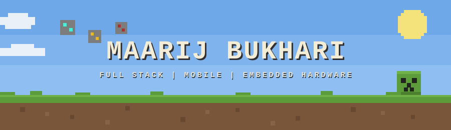
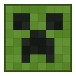
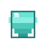
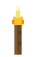
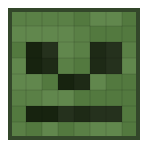
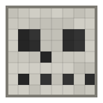

<!--
  GitHub profile README for maarij07  |  Minecraft theme
  Local assets referenced below must be committed to the repo root:
    minecraft_banner.svg  mob_creeper.svg  mob_enderman.svg  mob_zombie.svg
    mob_skeleton.svg  mob_steve.svg  item_torch.svg  item_diamond.svg
  See ASSETS.md for the palette, pixel grids and animation notes.
  Swap YOUR_LINKEDIN and the four project links before pushing.
  Palette: deepslate 2A2A30 | grass 5D9C3B/7FB238 | dark grass 3E6B26 | dirt 79553A
           diamond 4AEDD9 | gold E8B923 | redstone A83232 | amethyst 7A4FA3 | bone E8E3D3
-->

 

  

---

##  &nbsp;Spawn Point

- Software Engineer in Islamabad, building across web, mobile, and hardware
- Mobile developer at **Machadev**, shipping Flutter apps wired to in house firmware over BLE, WiFi, and UART (ESP32, STM32)
- Freelance full stack and product work under my **Crown Tech** brand
- Final year Software Engineering student at Air University Islamabad
- Currently mining **LLM and RAG pipelines**, dynamic embedded UI on DWIN displays, and in app purchase flows
- I like the whole loop: firmware on the board, API in the middle, app in the hand

---

##  &nbsp;Inventory

**Languages**

**Mobile and Frontend**

**Backend and Data**

**AI and LLM**

**Embedded and Hardware**

**Tools**

---

##  &nbsp;Player Stats

 

---

##  &nbsp;World Activity

---

##  &nbsp;Mob Encounters

&nbsp;&nbsp;

&nbsp;&nbsp;

&nbsp;&nbsp;

&nbsp;&nbsp;

 

Hand built pixel sprites. They idle, blink, and drift. Full grids and colors documented in ASSETS.md.

---

##  &nbsp;Advancements

---

##  &nbsp;Featured Builds

> Swap the `#` links for your repo URLs.

### [Smart Pen and Digital Notebook](#)
Camera based dot pattern pen with reusable erasable paper. ESP32 CAM, BLE, RGB LED, and haptic feedback, built as a low cost hardware prototype.
`ESP32-CAM` `BLE` `Firmware` `Flutter`

### [LEAP Dynamic Widget Controller](#)
Runtime widget customization on a DWIN DMG85480F0 display, toggling VP and SP based widgets live over UART from a Python controller.
`Python` `UART` `DWIN` `Embedded UI`

### [AU Classroom](#)
A richer take on Google Classroom with automatic grade sheets, Excel export, and built in webcam capture.
`React` `Firebase` `Node.js`

### [RepairHub](#)
Door to door device repair startup. We pick, we fix, we deliver.
`Flutter` `Express.js` `MongoDB`

---

